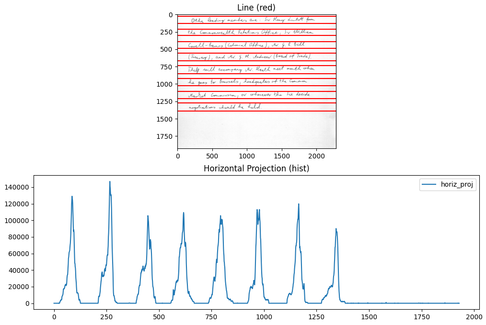
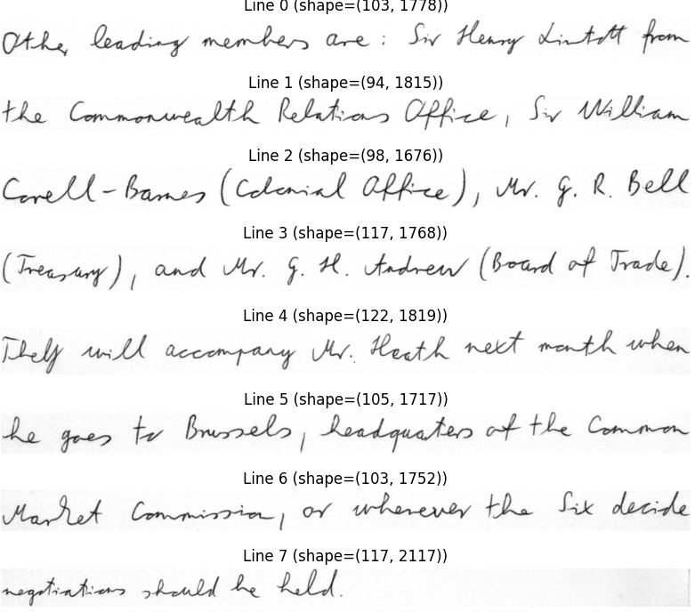

# Handwriting_to_digital
This project aims to convert handwritten text from scanned documents into digital text using OCR (Optical Character Recognition) techniques. The project combines line segmentation and OCR-based text extraction to achieve high-quality recognition results.

## 📌 Features  
- Preprocessing of scanned document images  
- Line segmentation for better OCR performance
- Transformer-based recognition using microsoft/trocr-base-handwritten model

## 🛠️ Technologies Used
- Glob
- OpenCv
- Transformers
- PIL
- Pytesseract
- Levenshtein

## 📊 Applications
- Digital archiving of handwritten notes and historical manuscripts
- Improving accessibility by converting handwriting into machine-readable text.
- Supporting educational tools for handwriting recognition.

# Example 
## Line Segmentation Image

## Output
Other leading members are : Sir Henry Lintott fromthe Commonwealth Relations Office , Sir WilliamCorell-Barnes ( Colonial Office ) , Mr. G. R. Bell( Treasury ) , and Mr. G. H. Andrew ( Board of Trade ) .They will accompany Mr. Heath next month whenhe goes to Brussels , headquarters of the CommonMarket Commission , or whenever the Six decidenegotiations should be held.

## Digital Text
Other leading members are: Sir Henry Lintott from the Commonwealth Relations
Office, Sir William Corell-Barnes (Colonial Office), Mr. G. R. Bell (Treasury), and Mr.
G. H. Andrew (Board of Trade). They will accompany Mr. Heath next month when
he goes to Brussels, headquarters of the Common Market Commission, or wherever
the Six decide negotiations should be held.

## Levenshtein Score
Levenshtein distance: 61  
Similarity: 0.9097938144329897
